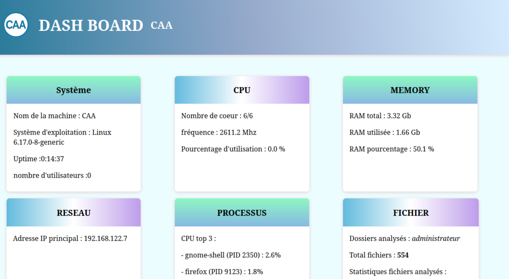

# Challenge Triple A - Dashboard de Monitoring
## Description
  C'est un monitor qui permet d'afficher les information de système
## Prérequis
- Python 
- Libvirtd,
- Virt-manager
- Apache2
- Git
  
## Installation

# Commandes pour installer les dépendances
  sudo apt-get install python3-venv
  
## Utilisation

# Comment lancer le script
Lancer la commande "python monitor.py" sur le terminal

# Ouvrir index.html dans le navigateur
Ouvrir dans le navigateur http://192.168.122.7

## Fonctionnalités
- Information système
- CPU
- Memory (RAM)
- Addresse IP
- Procesus en cours
- Afficher extension fichier
  
## Captures d'écran

  

## Difficultés rencontrées
Envoie donnée python au template.html
difficulter a synchroniser le code python au template.html

## Améliorations possibles
Export donnée template.html en fichier PDF
Afficher les donner sous forme de graphique ou banniere

## Auteur
<table>
  <thead>
    <tr>
      <th>Avatar</th>
      <th>Membre</th>
      <th>Rôle</th>
    </tr>
  </thead>
  <tbody>
    <tr>
      <td align="center">
        
      </td>
      <td><strong>Alya Annabi</strong></td>
      <td>HTML et CSS</td>
    </tr>
    <tr>
      <td align="center">
        
      </td>
      <td><strong>Childebert-Bouaichi</strong></td>
      <td>Cyber</td>
    </tr>
    <tr>
      <td align="center">
        
      </td>
      <td><strong>Evan Bonnal</strong></td>
      <td>Python</td>
    </tr>
  </tbody>
</table>
